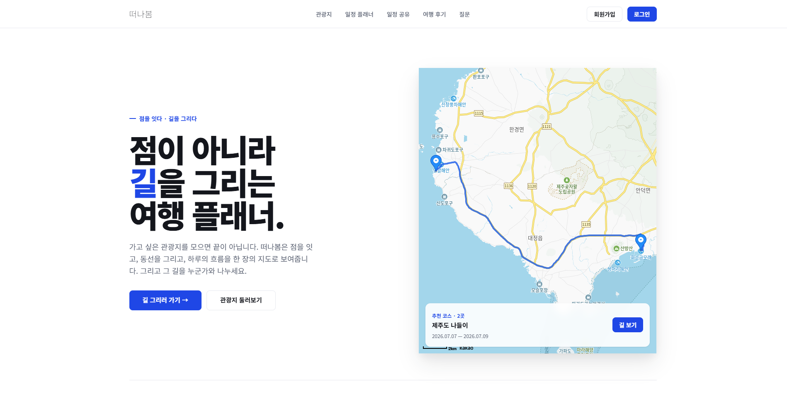
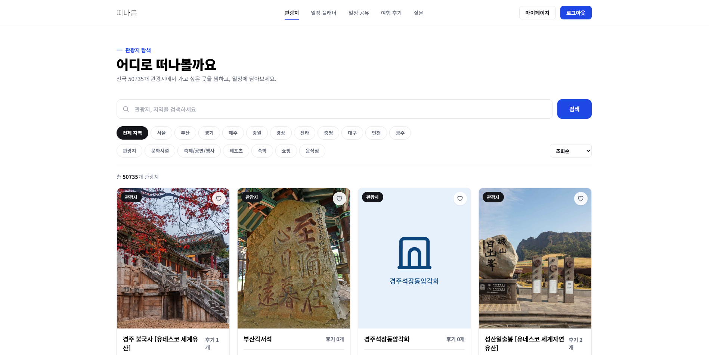
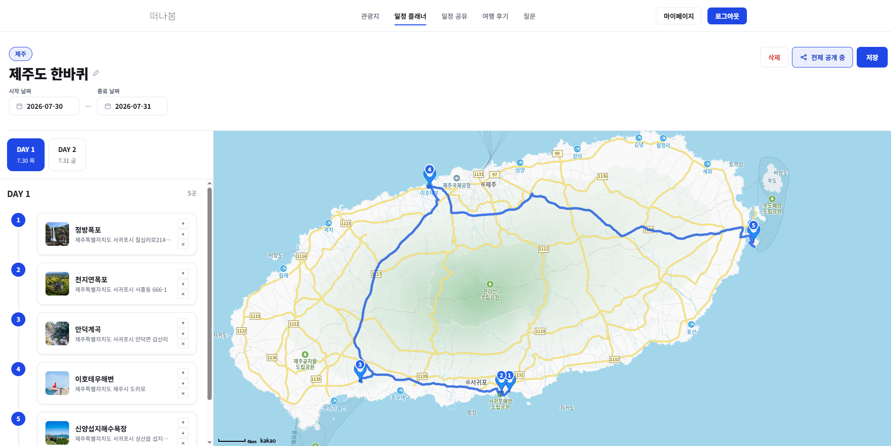
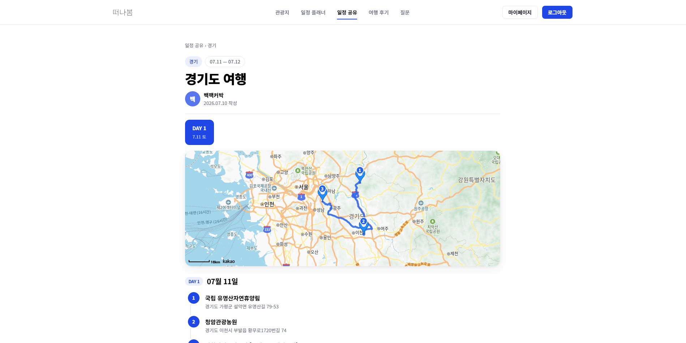
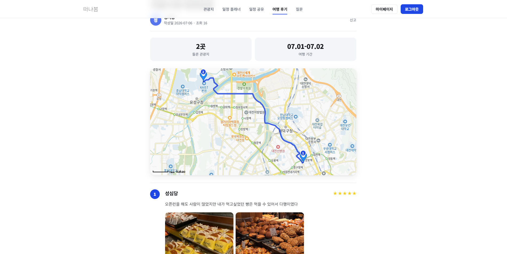

<div align="center">

# 떠나봄 (Ddeonabom)

**국내 여행 일정 계획 · 공유 웹 서비스**

KH 정보교육원 파이널 프로젝트 (6인 팀)

</div>

---

## 프로젝트 소개

**떠나봄**은 사용자가 날짜별로 여행 장소를 담아 일정을 짜고, 카카오맵 기반으로 최적 경로를 확인하며, 완성한 일정을 다른 사람과 공유·후기로 남길 수 있는 국내 여행 플래너 서비스입니다.

- **개발 기간** : KH 정보교육원 파이널 프로젝트
- **인원** : 6인 (팀장 1, 팀원 5)
- **배포** : AWS EC2(Ubuntu) + Nginx + systemd

---

## Screenshots

| 메인 | 관광지 탐색 |
|---|---|
|  |  |

| 일정 플래너 | 일정 공유 |
|---|---|
|  |  |

| 여행 후기 |
|---|
|  |

---

## Collaborators

| 이름 | 역할 |
|---|---|
| 박진희 | 프로젝트 팀장 · 일정 플래너 담당 |
| 김지윤 | 회원 담당 |
| 김은호 | 질문게시판 · 일정 공유 게시판 담당 |
| 임동혁 | 여행 후기 게시판 담당 |
| 유승우 | 관리자 페이지 담당 |
| 김성한 | 관광지 탐색 담당 |

---

## Stacks

### Environment


### Backend


### Frontend (Admin)


### Infra & External API


### Tools


---

## 주요 기능

| 도메인 | 설명 |
|---|---|
| 회원 | 회원가입(이메일 인증), 로그인, 아이디/비밀번호 찾기, 마이페이지, 회원 탈퇴 |
| 일정 플래너 | 여행 일정 생성/편집, Kakao Map 기반 경로 및 장소 관리 |
| 일정 공유 | 완성한 일정을 게시글 형태로 공유, URL 우회 접속 차단 |
| 여행 후기 | 이미지 첨부 후기 작성/수정, 댓글 |
| 질문 게시판 | 여행 관련 Q&A |
| 관광지 탐색 | TourAPI 연동 데이터를 지도에서 탐색 |
| 신고 | 게시글/댓글 신고 |
| 관리자 페이지 | 회원·게시글 관리, 공지 작성, 신고 처리, TourAPI 동기화, 통계 대시보드 (React SPA, `/admin`) |

---

## 프로젝트 구조

```
ddeonabom/
├── src/main/java/kh/ddeonabom/
│   ├── main/         # 메인 페이지
│   ├── member/        # 회원가입 · 로그인 · 이메일 인증 · 마이페이지
│   ├── schedule/       # 여행 일정 플래너 (경로/장소 관리)
│   ├── share/         # 일정 공유 게시판
│   ├── review/        # 여행 후기 게시판 (이미지 첨부)
│   ├── qList/         # 질문 게시판
│   ├── reply/         # 댓글 (공용)
│   ├── report/        # 게시글 신고
│   ├── landmark/       # 관광지 탐색 (지도 연동)
│   ├── admin/         # 관리자 기능 (공지/신고/통계/TourAPI 동기화)
│   └── common/        # 공통 설정 · 인터셉터 · 페이징 · 예외 처리
├── src/main/resources/
│   ├── mappers/        # MyBatis XML 매퍼
│   ├── templates/       # Thymeleaf 뷰
│   └── application.properties
├── src/main/admin/       # React 관리자 페이지 (Vite 프로젝트, 별도 빌드)
└── deploy.bat          # 로컬 → EC2 배포 스크립트
```

각 도메인 패키지는 `controller / service / model(vo, mapper)` 계층으로 구성되어 있습니다.

